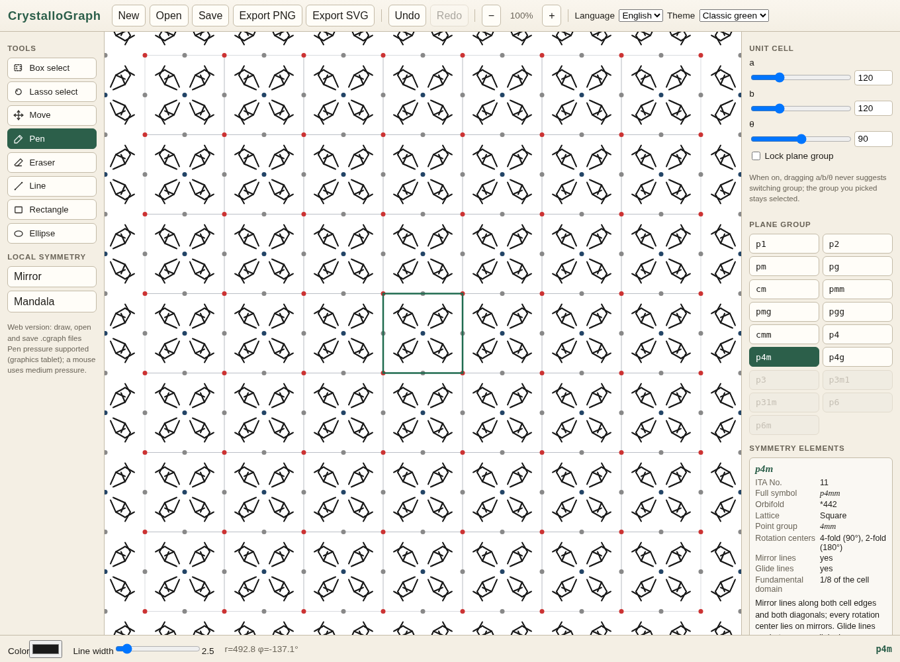

# CrystalloGraph

**English** · [简体中文](README.zh-CN.md)

Draw once, and let symmetry repeat it: an interactive drawing tool for the **17 plane groups** (wallpaper groups). The UI is available in English and Chinese.

**Try it in your browser: <https://sprw-li.github.io/CrystalloGraph/>**



## What are the 17 plane groups?

A wallpaper pattern repeats in two independent directions, the way tiles, fabrics and crystal faces do. Besides translations, a 2D periodic pattern can only have a few other kinds of symmetry: **rotation centers** (2-, 3-, 4- or 6-fold, nothing else), **mirror lines** and **glide lines** (a reflection followed by a half-period shift). Only **17 combinations** are possible. They are the plane groups, written in Hermann–Mauguin notation as `p1 p2 pm pg cm pmm pmg pgg cmm p4 p4m p4g p3 p3m1 p31m p6 p6m`. Each one belongs to one of five lattice types: oblique, rectangular, centered rectangular, square or hexagonal.

They matter because they are the 2D version of the 230 space groups that classify crystal structures, so they are a good way to learn how crystallographers think about symmetry. They also describe the repeating patterns of ornament, from Islamic tilework to M. C. Escher's prints. The smallest region that generates the whole pattern is called the **fundamental domain**. In CrystalloGraph you draw inside one cell, and the group generates every other copy.

## What the tool does

- Set the unit cell (a, b, θ) and switch between all 17 groups. The cell is constrained to fit the group (for example a = b and θ = 120° for hexagonal groups). Optionally, lock the group or let the app suggest a better-fitting group or cell as you drag the cell parameters.
- Only the **master cell** is editable. Strokes are stored in fractional coordinates, and every symmetry-equivalent copy is redrawn live.
- Tools: box and lasso select, move, pen (pressure-sensitive), eraser (whole stroke or along a path), line, rectangle and ellipse. You can also add a local mirror or an n-fold "mandala", snap to special points or strokes, and lock the polar coordinates r and φ.
- For each group, a **Symmetry elements** panel shows the ITA number, full symbol, orbifold symbol, lattice, point group, rotation centers, mirror and glide lines, and the size of the fundamental domain, with a plain-language description.
- Open and save `.cgraph` project files (JSON), and export PNG or SVG. Undo, redo, zoom and color themes are included.
- Language: Chinese (zh-CN) or English. The app follows your system or browser language (and falls back to English) and remembers what you pick in the in-app switch.

## Run it

You need Node.js 20 or newer.

```bash
npm install
npm run dev:web        # web version → http://localhost:5173
npm run build:web      # static build in apps/web/dist
npm run typecheck && npm test
```

Every push to `main` builds the web version and publishes it to GitHub Pages (`.github/workflows/pages.yml`).

The desktop version (Electron) is currently Windows-only. The Electron binary is not in git, so fetch it once first:

```powershell
powershell -ExecutionPolicy Bypass -File .\scripts\fetch-electron.ps1
npm run dev:desktop    # or double-click scripts\launch-desktop.bat
npm run shortcut       # optional: create a desktop shortcut
```

## Project structure

```
packages/core   shared core: symmetry groups, canvas, Zustand store, i18n string tables, .cgraph I/O, UI
apps/web        thin Vite web shell (renders the core AppShell)
apps/desktop    Electron desktop shell (same AppShell, Windows-first)
scripts/        dev launchers, Windows helpers, tests (test-*.mjs)
```

All UI text, including group descriptions, lives in `packages/core/src/i18n/locales.ts`, so the two shells share it. Crystallographic reference data lives in `packages/core/src/symmetry/groupInfo.ts`.

## License

MIT
