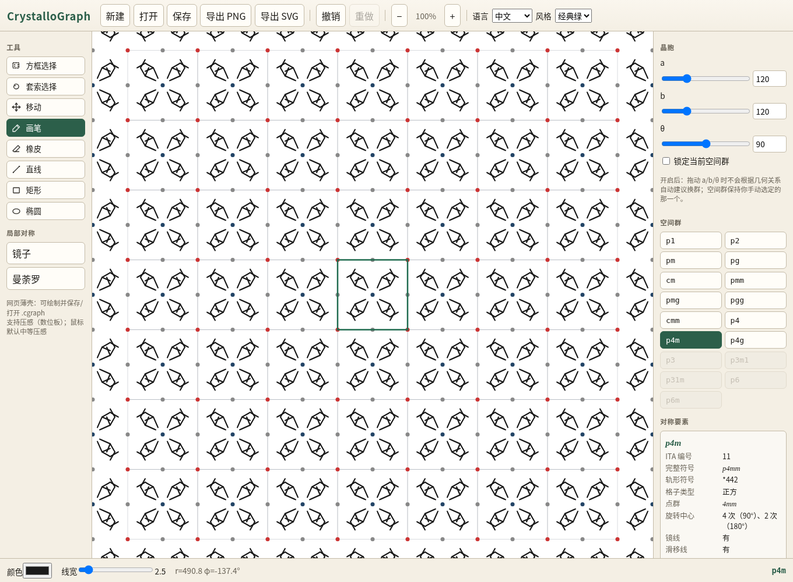

# CrystalloGraph

[English](README.md) · **简体中文**

对称绘画工具：17 种壁纸空间群、主框图唯一可编辑图层、极径/极角落笔、`.cgraph` 工程文件。



## 结构

```
packages/core   共享核心（对称群、画布、状态、i18n 文案表、.cgraph）
apps/web        网页薄壳（绘制 + 保存）
apps/desktop    Electron 桌面版（优先支持 Windows）
```

## 快速开始（网页版）

```bash
npm install
npm run dev:web        # http://localhost:5173
npm run typecheck && npm test
```

## 桌面版（可选）

```powershell
powershell -ExecutionPolicy Bypass -File .\scripts\fetch-electron.ps1
npm run dev:desktop
```

`vendor/electron` **不在** git 中，请先用上面的脚本下载（或只使用网页版）。

```bash
npm run shortcut       # 创建桌面快捷方式 CrystalloGraph.lnk
```

也可以双击 `scripts/launch-desktop.bat`。

## 功能

- 晶胞参数 a / b / θ，17 种空间群切换及约束
- 拖动参数时预告换群；可锁定空间群
- 主框图绘制（选择 / 移动 / 画笔 / 橡皮 / 直线 / 矩形 / 椭圆），局部镜子与曼荼罗
- 对称副本、特殊点吸引、显示模式
- “对称要素”面板：ITA 编号、完整符号、轨形符号、格子类型、点群、旋转中心、镜线、滑移线、基本区域
- 打开 / 保存 `.cgraph`，导出 PNG / SVG
- 中文 / English 界面：默认跟随系统/浏览器语言（其它语言回退到英文），界面内切换后会记住选择

## 许可证

MIT
